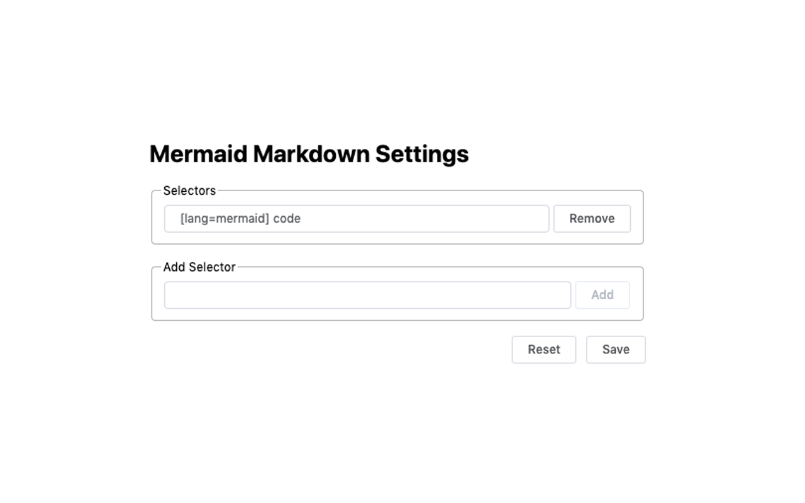

# Mermaid Markdown
| A Chrome extension that renders mermaid markdowns into graphs

# Install

[Mermaid Markdown on Chrome Store](https://chrome.google.com/webstore/detail/mboeoikjijmjcjgpccghbcoegikliijg)

# Changelog

## 1.0.0

- add basic functionality which will render embedded mermaid markdown in Github
